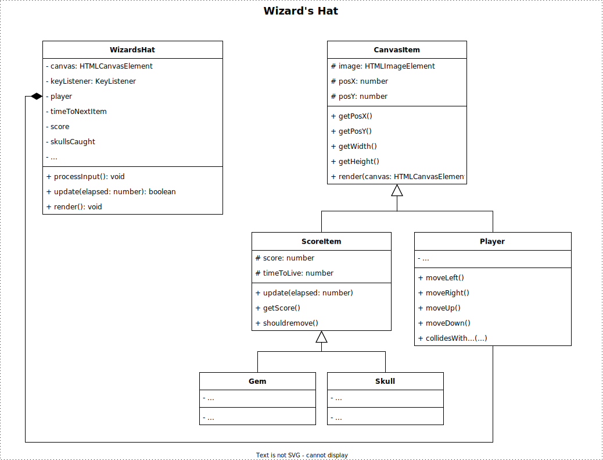

# Examen Object Oriented Programming (OOP) Herkansing

| Vak | Object Oriented Programming |
|---|---|
| Code | CU75004V1 |
| Datum | 25 januari 2024 |
| Tijd | 09:00 |
| Tijdsduur | 180 minuten (+extra) |
| Inleveren | Inleveren via CodeGrade |

**In geval van tegenstrijdigheid tussen de Engelse en Nederlandse versie van de instructies, geldt de Engelse versie als de definitieve en gezaghebbende bron.**

### Instructies
 - De technische vereisten voor het spel beginnen op pagina 2.
 - Download de starter .ZIP uit Learn.
 - Unzip en open de directory in je persoonlijke code editor, bijvoorbeeld Visual Studio Code.
 - Run `npm install`.
 - Implementeer de technische vereisten.
 - Run `npm run build` om de game te compileren. (Je kunt ook "watch mode" gebruiken met `npm run watch`).

### Toegestaan
 - Gebruik van je eigen laptop 

### NIET Toegestaan
 - Je mag geen gebruik maken van boeken en/of eigen notities.
 - Je mag het internet niet gebruiken als informatiebron of ter referentie
 - Je mag het internet niet gebruiken als communicatiemiddel (e-mail, Teams, Discord, posten op Stack Overflow en dergelijke).
 - Je mag geen gebruik maken van andere communicatiemiddelen zoals mobiele telefoons.
 - Je mag geen gebruik maken van of communiceren met AI diensten. In het bijzonder mag GitHub Copilot niet geïnstalleerd zijn op je IDE (Visual Studio Code).
 - Je mag geen gebruik maken van oortjes of hoofdtelefoon.
 - Je mag niet proberen om de geleverde code te deobfusceren of reverse-engineeren. 

### Inleveren
 - Je levert je code in op de bijbehorende CodeGrade.
 - Lever ENKEL je *.ts bestanden in. Als je je oplossing in meerdere mappen hebt ontwikkeld, moet je eerst een .zip van je bestanden maken.
 - Het is toegestaaan om tijdens het examen meerdere keren in te leveren.
 - CodeGrade zal alleen testen of je code succesvol compileert en de output van je ESLint. De rest van je examen wordt handmatig nagekeken.
 - De laatste inlevering wordt beschouwd als je uiteindelijke inlevering en zal beoordeeld worden.
 - De beoordelingscriteria staan op pagina 4.

<div class="page"/>

# Wizard's Hat
> De arme tovenaar Mordak is al zijn edelstenen weer kwijt en de schedels zitten er achteraan.

Met behulp van je toetsenbord bestuur je de hoed van de tovenaar. Om je heen verschijnen en verdwijnen edelstenen en schedels. Vang alle edelstenen en ontwijk de schedels.

## Voorbeeld demo

Je kunt een demonstratie spelen op: [https://hz-hbo-ict.github.io/ts-wizards-hat/](https://hz-hbo-ict.github.io/ts-wizards-hat/)

## Technische Vereisten

 - Een conceptueel klassendiagram wordt meegeleverd als uitgangspunt. Maak goed gebruik van OOP-principes bij het voltooien van de implementatie.

 - De aangeleverde bestanden `GameLoop.ts`, `CanvasRenderer.ts` en `KeyListener.ts` mogen niet gewijzigd worden.

 - De speler () begint in het midden van het scherm en beweegt naar links, rechts, omhoog en omlaag met behulp van het toetsenbord.

 - De score van de speler begint bij 0.

 - Willekeurig tussen 100ms en 200ms (milliseconden) verschijnt er een nieuwe edelsteen of schedel op het scherm, op een willekeurige locatie. Een edelsteen heeft 40% kans om te verschijnen en een schedel 60% kans.

 - Na een bepaalde tijd zal de edelsteen of schedel verdwijnen.

 - Er zijn 3 soorten edelstenen. Als de speler een edelsteen vangt, wordt zijn score verhoogd. Elke edelsteen heeft een andere scorewaarde, kans om te verschijnen en tijd dat het op het scherm blijft:
    1. Edelsteen Blauw : 1 punt, 50% kans om te verschijnen, blijft 2 - 9 seconden op het scherm
    2. Edelsteen Groen : 3 punten, 30% kans om te verschijnen, blijft 2 - 7 seconden op het scherm
    3. Edelsteen Rood : 5 punten, 20% kans om te verschijnen, blijft 2 - 4 seconden op het scherm

 - Er zijn 3 soorten schedels. Als de speler een schedel vangt, wordt zijn score verlaagd. Elke schedel heeft een andere scorewaarde, kans om te verschijnen en tijd dat het op het scherm blijft:
    1. Schedel Blauw : 10 punten, 50% kans om te verschijnen, blijft 3 - 5 seconden op het scherm
    2. Schedel Groen : 20 punten, 30% kans om te verschijnen, blijft 3 - 7 seconden op het scherm
    3. Schedel Red : 30 punten, 20% kans om te verschijnen, blijft 3 - 10 seconden op het scherm

 - De speler heeft een edelsteen of een schedel "gevangen" wanneer de afbeeldingen tegen elkaar botsen. *De pseudocode voor botsingsdetectie staat in de digitale versie van deze instructies.*

```
Pseudocode for Collision Detection
item.X + item.width >= player.X
&& item.X <= player.X + player.width
&& item.Y + item.height >= player.Y
&& item.Y <= player.Y + player.height
```

 - Het spel is afgelopen als de score van de speler lager is dan 0, of als de speler 3 of meer schedels heeft gevangen.

<div class="page"/>

### Conceptueel Klassendiagram


*Het is toegestaan om af te wijken van dit klassediagram, zolang de juiste principes van object georiënteerd programmeren gehandhaafd blijven.*

## Geavanceerde functionaliteit
**Besteed geen tijd aan de geavanceerde functionaliteit als de basisfunctionaliteit nog niet klaar is!**

De toverdrank () vernietigt alle schedels op het scherm. De toverdrank heeft 5% kans om te verschijnen. De toverdrank begint op een willekeurige plaats op het scherm en beweegt in elke richting met 0,2px per ms. Als de speler de toverdrank vangt, verdwijnen alle schedels op het scherm. De waarde van elke schedel wordt opgeteld (in plaats van afgetrokken) bij de score van de speler. De teller van het aantal doodshoofden dat de speler heeft gevangen wordt ook op 0 gezet.

Om deze functionaliteit te implementeren moet het design van een aantal klassen uitgebreid worden. Je hoeft dit design niet in te leveren.


<div class="page"/>

# Beoordelingscriteria

**Beoordelingsdrempel:** Code moet foutloos compileren met de TypeScript compiler. Als de code niet compileert, is het cijfer een 1,0. Als, naar het oordeel van de beoordelaar, de compilatiefout verholpen kan worden door minder dan 30 seconden te besteden, dan kan het nakijken doorgaan.

| Nr | Criterium | Onvoldoende | Voldoende | Goed | Uitstekend |
|---|---|---|---|---|---|
| 0 | Code compileert | Code compileert niet. (0 punten) | Code moet compileren zonder fouten van de TypeScript compiler. (10 punten) | | |
| 1 | Code kwaliteit en stijl | Stijl en kwaliteit zijn onvoldoende. ESLint fouten zijn aanwezig. (0 punten) | Types worden correct gebruikt voor variabelen, attributen en methodes. Enkele ESLint-waarschuwingen (minder dan 5). (5 punten) | Types zijn correct gebruikt. Geen ESLint-waarschuwingen, maar commentaar en documentatie onvoldoende. (7 punten) | Types worden correct gebruikt. Geen ESLint problemen. Goede kwaliteit en stijl, inclusief volledige JSDocs. (10 punten) |
| 2 | Objectgeoriënteerde programmeerprincipes en concepten | De meeste klassen ontbreken. Implementatie van de meeste klasseleden (attributen en methoden) ontbreekt. (0 punten) | Basisklassen voor functionaliteit van spel aanwezig. Alle vereiste klasseleden zijn geïmplementeerd. (10 punten) | De meeste klassen die nodig zijn voor een functioneel spel zijn aanwezig met het juiste gebruik van compositie. Abstracte klassen zijn afwezig. De meeste klasseleden communiceren op de juiste manier. (15 punten) | Klassen die nodig zijn voor een functioneel spel (geërfd en abstract) zijn aanwezig met goed gebruik van overerving en compositie. Polymorfisme wordt goed gebruikt om dubbele code te verminderen (30 punten).
| 3 | Functionaliteit van het spel | Het spel heeft weinig tot geen functionaliteit. (0 punten) | Het spel is speelbaar maar niet compleet. Functionaliteit ontbreekt. (20 punten) | Spel is in principe compleet, maar niet alle functies zijn aanwezig. (30 punten) | Spel functioneert precies zoals vereist. (40 punten)
| 4 | Geavanceerde functie | Geavanceerde functie niet geprobeerd. (0 punten) | Sporen van geavanceerde functie aanwezig, maar niet functioneel. (3 punten) | Geavanceerde functie functioneel, maar onvolledig. (6 punten) | Geavanceerde functie werkt precies zoals vereist. (10 punten)

## Credits
 - https://www.freepik.com/free-vector/falling-people-isolated-icon-set-young-adults-children-fall-from-anywhere-vector-illustration_41922694.htm
 - https://www.freepik.com/free-vector/magic-crystal-balls-fortune-teller-globes-set_34567889.htm
 - https://www.freepik.com/free-vector/flying-cartoon-monsters-set-kids-party-flying-monsters-with-wing-illustration-monster-character_13031454.htm
 - https://www.freepik.com/free-vector/cartoon-set-funny-baby-monsters_41370903.htm